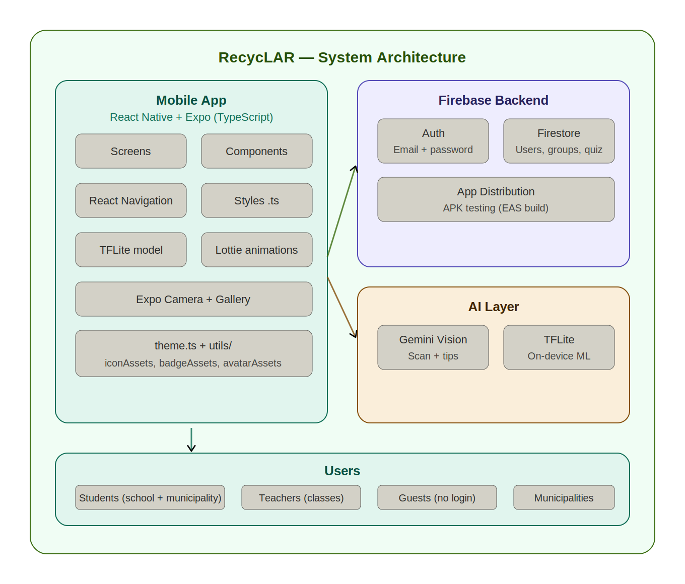

# RecycLAR

> Skeniraj. Loči. Uči se.

Mobile app for Slovenian students to learn recycling. Scan waste to find the right bin, complete quizzes to earn points, and compete with classmates on the leaderboard.

---

## Features

| | |
|---|---|
| **Scanner** | Camera identifies waste and returns the correct bin with municipality-specific rules and a tip from the mascot Lari |
| **Quiz** | 3 topics × 10 levels, AI-generated questions, points (eko točke) for correct answers |
| **Leaderboard** | Weekly / monthly / all-time rankings for individuals and school classes |
| **Map** | Nearby EKO otoki |
| **Profile** | Badges, achievements, streak counter, activity history |
| **Roles** | Students grouped into school classes; teacher accounts manage classes |

---

## Tech Stack

| | Technology |
|---|---|
| Mobile | React Native + Expo (TypeScript) |
| Navigation | React Navigation |
| Backend | Firebase Auth + Firestore |
| AI | Google Gemini Vision |
| On-device ML | TensorFlow Lite |
| Animations | React Native Animated API + Lottie |

---

## Project Structure

```
apps/mobile/
├── screens/      # One file per screen
├── components/   # BottomNavBar, DecorativeBackground
├── styles/       # StyleSheet per screen
├── utils/        # Theme, asset maps, city storage,question generation
├── firebase/     # Firebase config
└── assets/       # Images, Lottie animations, TFLite model
```

---

## Architecture



---

## Dependencies

See `package.json` for the full list. Key external dependencies:

| Package | Purpose |
|---------|---------|
| `firebase` | Auth, Firestore database |
| `expo-camera` | Waste scanning |
| `lottie-react-native` | Animations |
| `react-native-confetti-cannon` | Quiz celebrations |
| `@react-navigation/native` | Screen navigation |

---

## Getting Started

### Prerequisites

- Node.js v18+
- Expo Go on your phone (UI only), or a dev build for camera features

### Install

```bash
git clone https://github.com/your-org/recyclar.git
cd recyclar/apps/mobile
npm install
```

### Environment

Create `apps/mobile/.env`:

```bash
EXPO_PUBLIC_FIREBASE_API_KEY="..."
EXPO_PUBLIC_FIREBASE_AUTH_DOMAIN="..."
EXPO_PUBLIC_FIREBASE_PROJECT_ID="..."
EXPO_PUBLIC_FIREBASE_APP_ID="..."
EXPO_PUBLIC_GEMINI_API_KEY="..."
```

### Run

```bash
npx expo start        # Expo Go — no camera
npx expo run:android  # Dev build with camera (Android)
npx expo run:ios      # Dev build with camera (Mac only)
```

---

## Bin Rules (Slovenia)

> Bin colors vary by municipality. RecycLAR applies the correct rules based on the municipality selected at registration.

| Bin | Common color | Accepts |
|-----|-------------|---------|
| Embalaža | Yellow | Plastic, cans, packaging, Tetra Pak |
| Papir | Blue | Paper, cardboard |
| Steklo | Green | Glass |
| Bio odpadki | Brown | Food and organic waste |
| Mešani odpadki | Black | Everything else |

Municipality-specific rules are stored in Firestore and returned with every scan result.

---

## Distribution

```bash
# Android APK — share directly
eas build --platform android --profile preview

# iOS TestFlight
eas build --platform ios --profile preview
eas submit --platform ios

# Production stores
eas build --platform all --profile production
eas submit --platform all
```

Requires a Google Play Developer account ($25 one-time) and/or Apple Developer account ($99/year) for store release.

---

## User Guide

### For Students

1. **Register** — choose your municipality and school class during sign-up
2. **Scan waste** — tap *Skeniraj*, point the camera at any waste item, and get the correct bin instantly
3. **Take quizzes** — go to *Kviz*, pick a topic and level, answer questions to earn eko točke
4. **Check the leaderboard** — see how your class ranks against others in *Lestvica*
5. **Track progress** — view your badges, streak, and activity history in *Profil*

### For Teachers

1. **Register as a teacher** — select the teacher role during sign-up
2. **Create a class** — go to your profile and create a class; share the invite code with students
3. **Monitor your classes** — view total points, quiz completions, and student count per class
4. **Leaderboard** — track how your classes rank against others in the school

### Guest Access

Users without an account can browse the waste map and bin information, but cannot earn points or access quizzes.

---

## ML Model

The waste classification model was trained in Google Colab using MobileNetV2 and transfer learning.

**Training pipeline:**
1. Dataset from Roboflow (10,472 labeled images)
2. Second dataset from Kaggle — merged for better coverage
3. MobileNetV2 fine-tuned with transfer learning
4. Exported to TFLite for on-device inference

**Result:** 2.74 MB TFLite model, 97.35% accuracy, runs fully on-device — no internet required.

**Categories:** biodegradable, cardboard, glass, metal, paper, plastic, trash

---

## Further Development

### ML Model Improvement
The current TFLite model was trained on a limited dataset. We plan to collect real-world scan images monthly from app usage, retrain the model on the expanded dataset, and release improved versions over time. More scans = better accuracy.

### Planned Features
- **iOS release** — currently Android only; iOS build planned once core features are stable
- **Push notifications** — remind students about daily streaks and new quiz levels
- **Teacher dashboard** — dedicated web view for teachers to manage classes and view analytics
- **Offline mode** — basic scanning without internet connection
- **More municipalities** — expand bin rules beyond current supported cities
- **Multilingual** — full Serbian and Macedonian translations 

### Known Limitations
- Scan accuracy depends on image quality and lighting
- Municipality bin rules must be manually updated in Firestore
- Scan images collected for model retraining must be manually reviewed and sorted before use